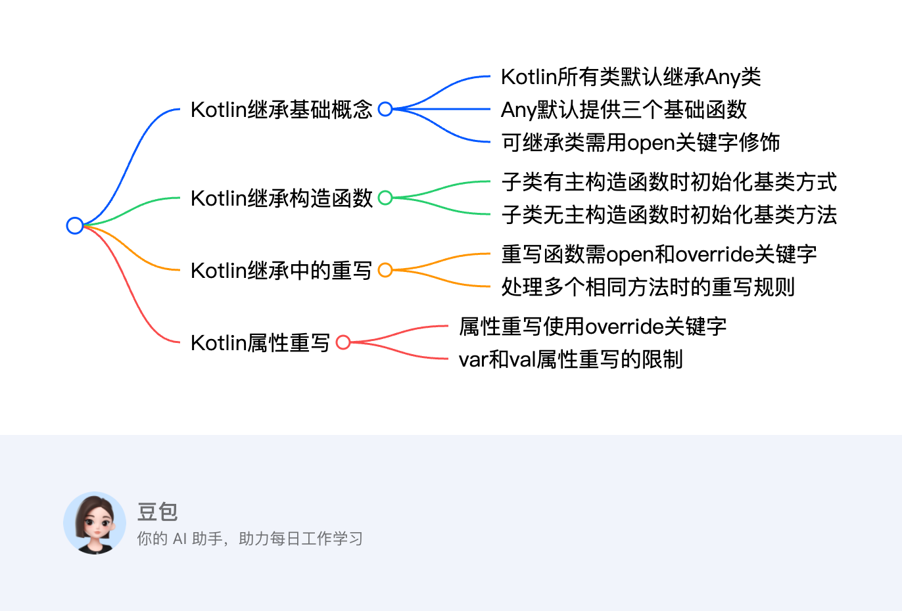
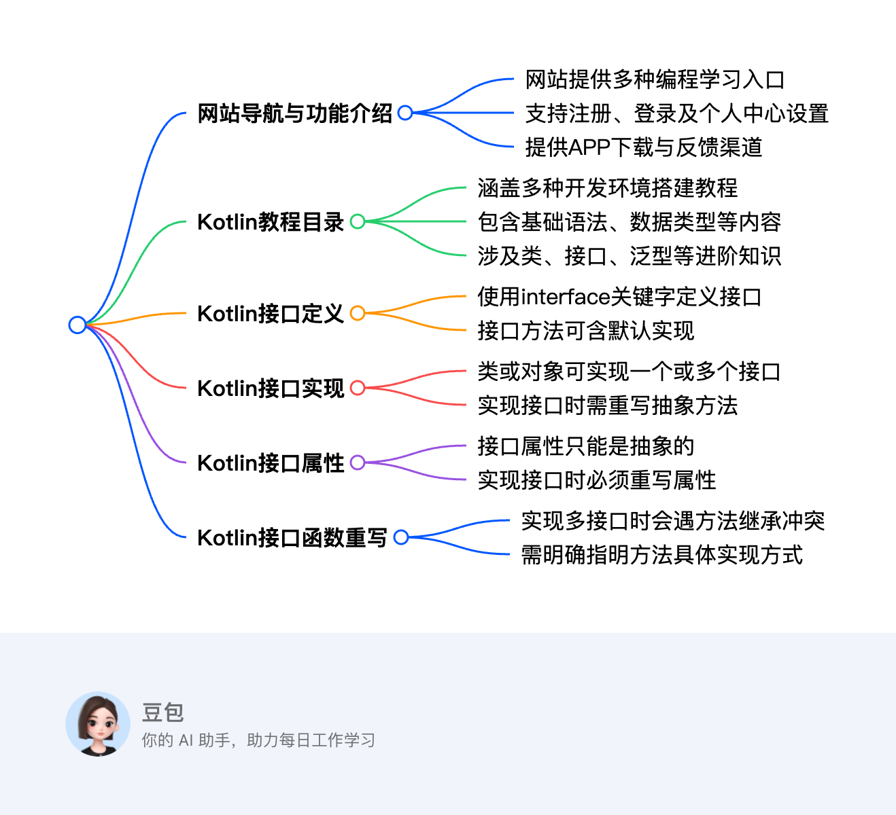
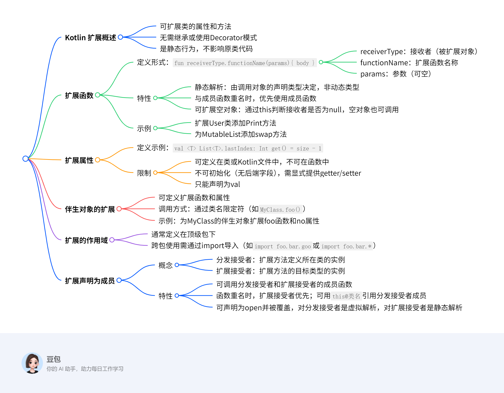

# 继承

## 所有类均隐式继承自Any

## 所有类均有以下方法
```` java
equals()

toString()

hashCode()
````
## 类和方法都需要加open 关键字打开默认的final 修饰

## 如果父类有构造函数，
    子类有主构造函数需要在主构造函数立即实现父类的构造函数
    子类如果无主构造函数需要再次级构造函数直接或代理实现父类构造函数

## 如果有多个同名方法继承自他实现的类必须重写同名的fangfa使用<>定义

## 关键字加open可重写属性 val 的属性可以被var 重写 var 的属性不能被val 重写，可新增方法，不能删方法



# 接口
    接口可默认实现可不实现
    接口可以有属性但是属性不能有值，在实现他的时候必须赋值
    当继承多个接口出现重名是需要实现复写接口，当类和接口重名，接口没实现时不用复写，接口有实现也要复写



# 拓展
    kotlin 可以对一个类的属性和方法进行拓展
    拓展和继承的方法不一样，调用的对象是哪个执行的就是那个
    拓展函数和成员函数一致优先使用拓展函数
    拓展属性不允许赋值，只能使用getter 和 setter
    半生对象也可定义拓展函数
    一般拓展函数定义在kt 文件中整个kt 文件有效，定义在类中整个类有效，其他位置想用需要导包
    拓展函数可以被继承



